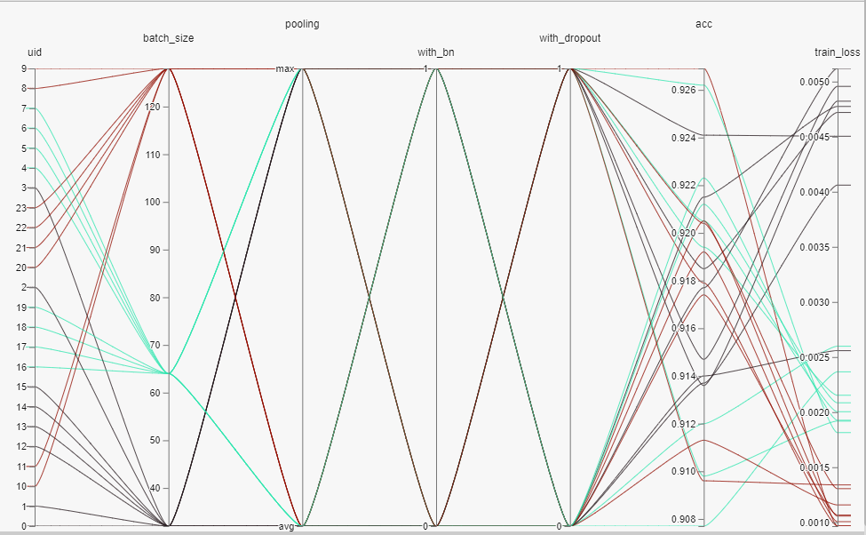

# Fashion MNIST
## Introduction
A series of experiments were conducted to design a network that performed the best on the Fashion MNIST dataset found here

## Network Design
The network is 3 convolutions + 1 FC layer and has about 400K parameters.  It's not based off of any model in particular, just given the small image shape out of the box solutions such as VGG would have been difficult.  Also, the goal of this was to make a reasonable model.  The model size is like 1.6MB and inference takes on average 4.3ms.  

## Experiment Design
I tested the following variables:
1. With/Without Batch Normalization
2. With/Without Dropout (Last conv layer 0.2)
3. Avg pooling vs Max pooling
4. Batch size (32, 64, 128)

I used an Adam optimizer with a high learning rate, to help converge faster.  I used softmax + NLL loss for the classificaton.  Data augmentation was not used, but from what I've seen from the Fashion MNIST leaderboard, it would definitely be useful.  My early stopping criteria was 4 epoch's where the testing loss does not decrease.

## Results
The best performing network ended up being Avg pooling with dropout and no batch normalization

## Observations and Conclusions
1.  Batch size of 64 and 128 seemed to have little impact, but a batch size of 32 did appear to be detrimental.
2.  Max pooling results were a lot worse with dropout than Avg pooling.  This is probably due to max pooling dropping a lot of data already.
3.  Batch normalization had little effect, but this is likely due to an error on my part where I did not remove the bias from the convolutional layers.

## Considerations/Potential further experiments
1. I initially tested with learning rate, but I found that I was largely converging to the same results, but at a much slower rate.  Due to the time constraints I had for this project, I ultimately decided to nix testing learning rate.  Since I was using an Adam optimizer, I opted for a high learning rate (1e-3) as Adam can typically handle this high of a learning rate.  This allowed the networks to converge much faster (several epochs).  If I had more time to work on this assignment I would likely test the learning rates again, as well as look at the use of learning rate decay.
2. As mentioned above I did not set the with_bias=False in the convolutional layers that I used batch normalization.  This is something I would definitely also add if given more time.
3. I used Adam optimization, you could play with different optimzers, as well as including weight decay.
4. Further experiments could also include modifying the activation functions (leaky ReLU or PReLU), playing with the convolution filter sizes, and including data augmentation.
5. Data augmentation such as flipping, random noise, or label shifting.
6. Modifying the early stopping criteria to be based on test accuracy instead of test loss.  I noticed quite a few times the best test score was with a slightly higher 

# About the code

## main.py
This does the training and testing.  It loads the fashion MNIST via the torchvision interface and then conducts the experiments.  The output is results.txt.  There is more information than needed here.  I left this data in here largely to possibly experiment with at a later date.  It also outputs the lowest loss model for a given experiment and stores it in models/experiment_num/best.pt.

## parse_results.py
This reads in the results.txt generated in main.py and outputs results_parsed.txt, which can be used to visualize in [Facebook's hiplot](https://ai.facebook.com/blog/hiplot-high-dimensional-interactive-plots-made-easy/)

## model.py
This contains the model structure

## inference.py
Runs inference on the testing dataset and outputs the average inference time.

## check_params.py
This opens a model that was saved and outputs the total number of trainable parameters

## Hiplot Visualization Notebook
This reads in the results_parsed.txt file and visualizes the data in a hiplot 
Below is a screen shot of the plot 

## Others
I have also included the results_parsed.txt and results.txt from my experimentation

## Dependencies
PyTorch 
Torchvision 
Hiplot  (pip install hiplot)